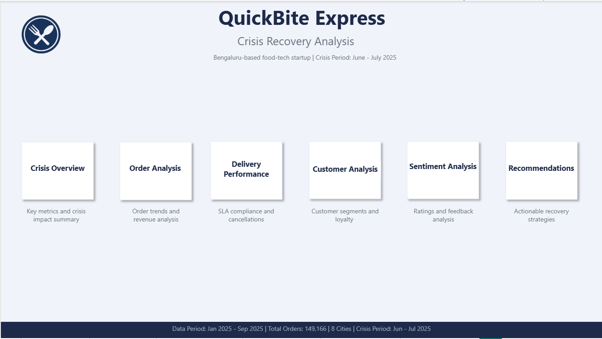
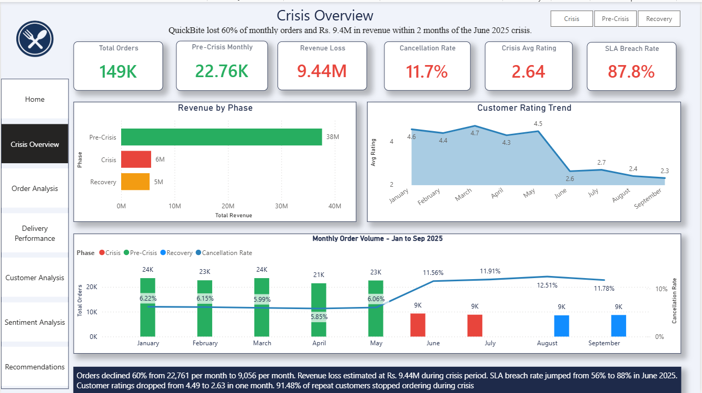
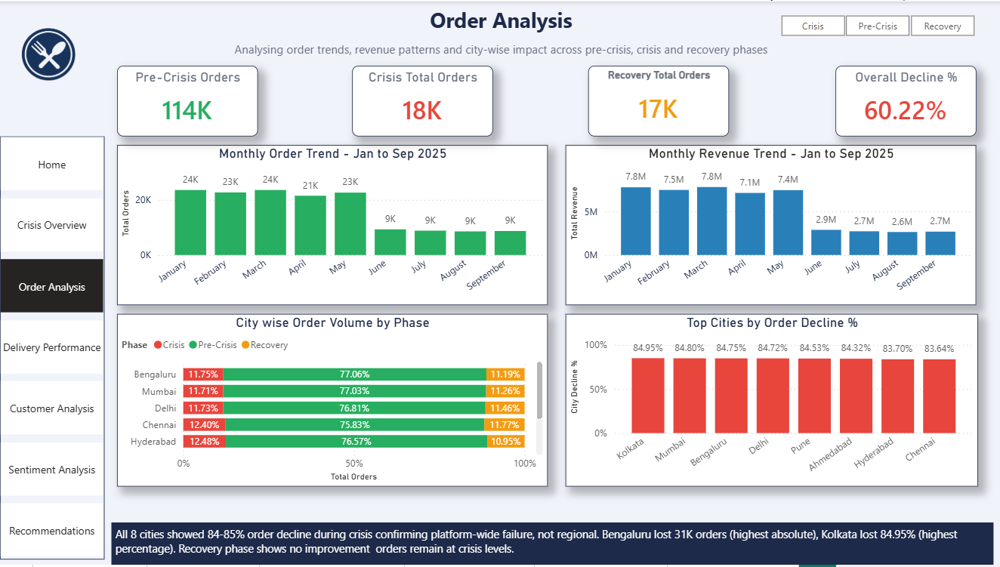
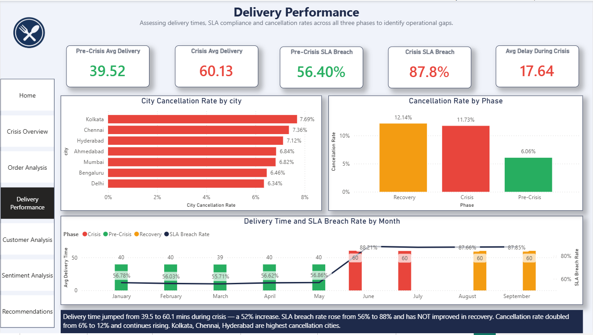
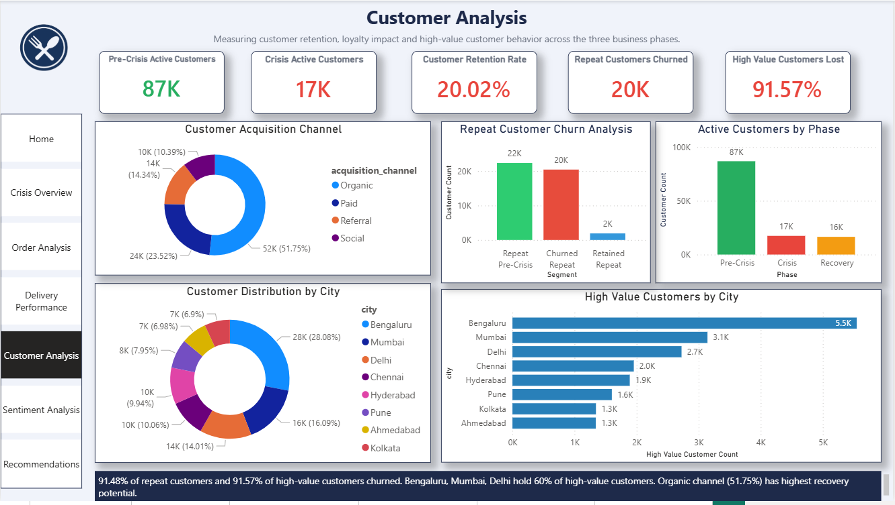
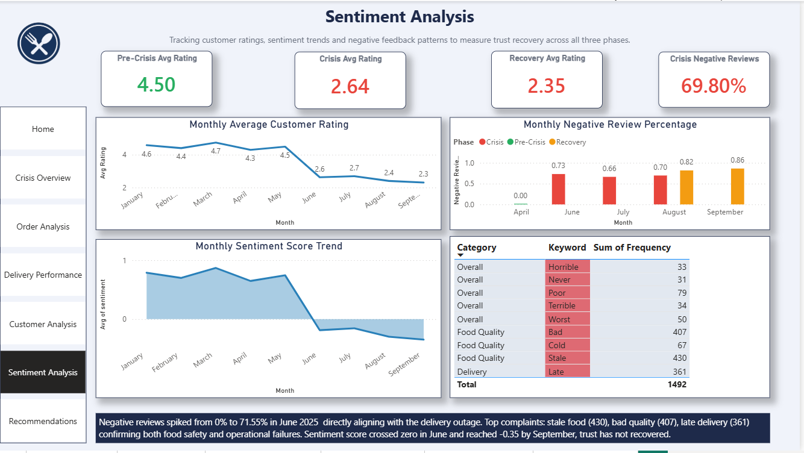
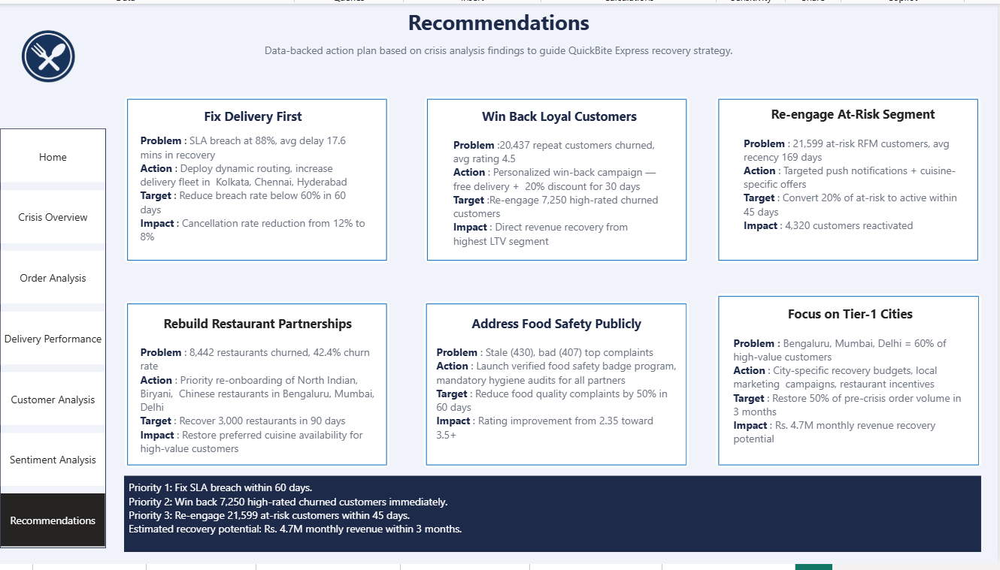

# QuickBite Express — Crisis Recovery Analysis

> 149,166 orders | 9 months of data | 8 Indian cities | June 2025 crisis

---

## What happened

QuickBite Express is a Bengaluru-based food delivery startup. In June 2025, two things happened at the same time — a viral social media incident about food safety violations at partner restaurants, and a week-long delivery outage during monsoon season. Competitors ran aggressive campaigns right when QuickBite was most vulnerable.

The numbers were bad. Monthly orders dropped from 22,761 to 9,056 in a single month. Ratings fell from 4.49 to 2.63. Revenue collapsed. The company had already invested in a recovery budget and fixed their infrastructure — but by September 2025, the data showed that nothing had improved yet.

Management needed to understand exactly what broke, which customers could be brought back, and where to focus the recovery budget.

---

## My approach

I broke the 9 months of data into three phases and compared everything across them:

- **Pre-Crisis** — January to May 2025 (baseline)
- **Crisis** — June to July 2025 (impact period)
- **Recovery** — August to September 2025 (intervention period)

I used Python for data cleaning and analysis, MySQL for business queries, and Power BI for the dashboard. The analysis covered orders, revenue, delivery performance, customer behavior, ratings, sentiment, and restaurant partnerships.

One data quality issue I flagged upfront: 3.4% of orders had customer IDs that didn't match the customer dimension table. These were excluded from city-level and demographic analysis. Also, the dataset has 19,995 restaurants spread across 9 months, so the maximum pre-crisis orders for any single restaurant was 21 — the original 50-order threshold from the problem statement was not applicable to this data, so I adjusted it to 10.

---

## Dataset

8 tables — 4 fact tables, 4 dimension tables.

| Table | Rows | What it contains |
|---|---|---|
| fact_orders | 149,166 | Every order with timestamp, amount, cancellation |
| fact_order_items | 342,994 | Individual items per order |
| fact_ratings | 68,842 | Customer ratings and review text |
| fact_delivery_performance | 149,166 | Actual vs expected delivery time |
| dim_customer | 107,776 | City and acquisition channel |
| dim_restaurant | 19,995 | Cuisine type, partner type, active status |
| dim_delivery_partner | 15,000 | Vehicle type, avg rating |
| dim_menu_item | 342,671 | Item categories and prices |

---

## Key findings

### Orders and Revenue

Monthly orders dropped 60.22% from 22,761 to 9,056. All 8 cities declined between 83% and 85% — this was a platform-wide collapse, not a regional problem. Kolkata had the highest percentage decline (84.95%), Bengaluru had the highest absolute loss (31,277 orders).

Total revenue dropped from Rs. 37.6M in the pre-crisis period to Rs. 5.6M during crisis. The estimated revenue loss over the 2-month crisis period is **Rs. 9.44M**.

One thing that stood out: average order value stayed flat at Rs. 351 across all three phases. Customers who kept ordering didn't reduce their spend — they just disappeared in large numbers. This matters for recovery strategy.

### Delivery Performance

Pre-crisis, average delivery time was 39.5 minutes against an expected 37.5 minutes — SLA breach rate was already 56.4% before the crisis hit. This was a pre-existing weakness.

During crisis, actual delivery time jumped to 60.1 minutes. SLA breach rate hit 87.84%. Average delay per order was 17.6 minutes. In the recovery phase — same numbers. No improvement at all.

### Ratings and Sentiment

Ratings held between 4.30 and 4.74 for five months, then dropped from 4.49 in May to 2.63 in June — the sharpest single-month fall in the dataset. By September, ratings were at 2.31, the lowest point recorded.

Negative reviews went from 0% to 71.55% in a single month. By September, 86.38% of all reviews were negative. Sentiment score crossed zero in June and never came back.

Top negative keywords from crisis reviews: **stale (430), bad (407), late (361), poor (79), cold (67)**. Two clear problem areas — food quality and delivery time.

### Customer Impact

87K pre-crisis active customers dropped to 17K during crisis — 80% decline. Among repeat customers (2+ pre-crisis orders), 20,437 out of 22,342 stopped ordering during crisis — **91.48% churn rate**. Of those churned repeat customers, 7,250 had an average pre-crisis rating above 4.5. They were satisfied before June 2025 — they left because of the crisis, not because of platform dissatisfaction.

High-value customers (top 5% by pre-crisis spend, threshold Rs. 932) — 3,823 out of 4,144 stopped ordering. **92.25% churn rate**. Their average pre-crisis rating was 4.51. 60% of these customers are in Bengaluru, Mumbai, and Delhi. Their preferred cuisines were North Indian, Biryani, and Chinese.

### Restaurant Churn

8,442 restaurants that were active pre-crisis did not receive any orders in the recovery phase — 42.4% restaurant churn. 7,608 of these are still marked active in the system, meaning they likely shifted to competitor platforms rather than shutting down. North Indian, South Indian, and Chinese cuisine restaurants had the highest churn counts — directly affecting the food preferences of high-value customers.

### RFM Segmentation

I segmented all 99,790 customers using Recency, Frequency, and Monetary scores (1-3 each, total 3-9). Thresholds: 8-9 = Champions, 6-7 = Loyal, 5 = At-Risk, 4 = Needs Attention, 3 = Lost.

| Segment | Customers | Avg Recency | Avg Spend |
|---|---|---|---|
| Champions | 26,008 | 101 days | Rs. 804 |
| Loyal | 27,857 | 133 days | Rs. 464 |
| At-Risk | 21,599 | 169 days | Rs. 348 |
| Needs Attention | 17,872 | 212 days | Rs. 307 |
| Lost | 6,454 | 233 days | Rs. 259 |

The At-Risk segment (21,599 customers) is the most urgent. Average recency of 169 days means they're disengaging but not gone yet. Without action in the next 30-45 days, they move to Lost permanently.

---

## SQL work

I wrote 10 business queries in MySQL covering all primary analysis questions. A few approaches worth highlighting:

**Phase comparison using CASE WHEN** — used consistently across all queries instead of separate subqueries for each phase. Cleaner and easier to maintain.

**Restaurant decline analysis using CTEs with monthly averages** — since pre-crisis had 5 months and crisis had 2 months, comparing raw totals would be misleading. I divided each restaurant's order count by the number of months in that phase before comparing. Used `COALESCE` to handle restaurants that received zero crisis orders without dropping them from results.

```sql
-- simplified version of the approach
WITH pre AS (
    SELECT restaurant_id, COUNT(order_id) / 5.0 AS avg_monthly
    FROM fact_orders WHERE order_timestamp < '2025-06-01'
    GROUP BY restaurant_id
),
crisis AS (
    SELECT restaurant_id, COUNT(order_id) / 2.0 AS avg_monthly
    FROM fact_orders WHERE order_timestamp >= '2025-06-01'
      AND order_timestamp < '2025-08-01'
    GROUP BY restaurant_id
)
SELECT ..., COALESCE(c.avg_monthly, 0) ... FROM pre p LEFT JOIN crisis c ...
```

**Top 5% customer identification using NTILE(20)** — instead of hardcoding a spend threshold, I used a window function to divide customers into 20 equal groups by spend. Group 1 = top 5%. This adapts automatically if the data changes.

**Delivery delay impact on ratings** — one extra query I wrote to directly validate whether delayed deliveries caused lower ratings. Joined three tables (fact_orders, fact_delivery_performance, fact_ratings) and compared avg rating for on-time vs delayed orders. This gave direct evidence to support the delivery fix recommendation.

---

## Recommendations

**1. Fix delivery first (0-30 days)**
SLA breach rate is 88% and hasn't moved. Average delay is 17.6 minutes per order. Focus on Kolkata, Chennai, and Hyderabad — highest cancellation rates during crisis. Target: get breach rate below 60% within 60 days. Expected impact: cancellation rate drops from 12% to 8%.

**2. Win back high-satisfaction churned customers (0-30 days)**
7,250 churned repeat customers had pre-crisis ratings above 4.5. They were happy before the crisis. This is the highest return-probability segment. Personalized win-back campaign with free delivery and 20% discount for 30 days. Target these customers specifically by their pre-crisis cuisine preferences.

**3. Re-engage At-Risk RFM segment (30-45 days)**
21,599 customers, avg recency 169 days. Still reachable but window is closing. Targeted push notifications with cuisine-specific offers. Goal: convert 20% to active — roughly 4,320 customers reactivated.

**4. Rebuild restaurant partnerships (30-90 days)**
7,608 restaurants are still marked active but stopped receiving orders. Priority re-onboarding for North Indian, Biryani, and Chinese cuisines in Bengaluru, Mumbai, Delhi. These cuisines are exactly what high-value customers ordered. Target: recover 3,000 partnerships in 90 days.

**5. Address food safety publicly (30-60 days)**
Stale food (430 mentions) and bad quality (407 mentions) are the top two complaints. Launch a verified food safety badge program with mandatory hygiene audits. Communicate it directly on social media — counter the original viral incident. Target: rating improvement from 2.31 toward 3.5+.

**6. Focus recovery budget on Bengaluru, Mumbai, Delhi (60-90 days)**
These three cities hold 60% of all high-value customers. City-specific campaigns with local restaurant incentives. Target: restore 50% of pre-crisis order volume in top 3 cities within 3 months. Estimated monthly revenue recovery potential: Rs. 4.7M.

---

## Tools

| Tool | What I used it for |
|---|---|
| Python (Pandas, Matplotlib) | Data cleaning, EDA, phase analysis, RFM segmentation, keyword extraction |
| MySQL | 10 business queries covering all primary analysis questions |
| Power BI | 7-page interactive recovery dashboard with DAX measures |

---

## Project structure

```
QuickBite-Crisis-Recovery-Analysis/
│
├── README.md
├── data/                          # 8 CSV datasets
├── python/
│   ├── 01_data_overview.ipynb     # Data quality checks, phase setup
│   ├── 02_primary_analysis.ipynb  # All 10 primary questions
│   ├── 03_rfm_segmentation.ipynb  # Customer segmentation
│   └── 04_extra_insights.ipynb    # Behavior shift, sentiment spike, restaurant churn
├── sql/
│   └── 02_business_queries.sql    # 10 MySQL business queries
├── powerbi/
│   └── quickbite_dashboard.pbix
├── presentation/
│   └── quickbite_presentation.pptx
└── assets/                        # Dashboard screenshots
```

---

## Dashboard pages

## Home


## Crisis Overview


## Order Analysis


## Delivery Performance


## Customer Analysis


## Sentiment Analysis


## Recommendations


---

*Analyst: Priyanka Chaudhary*
*Data Period: January 2025 to September 2025*
*Domain: Food Delivery and Consumer Analytics*
